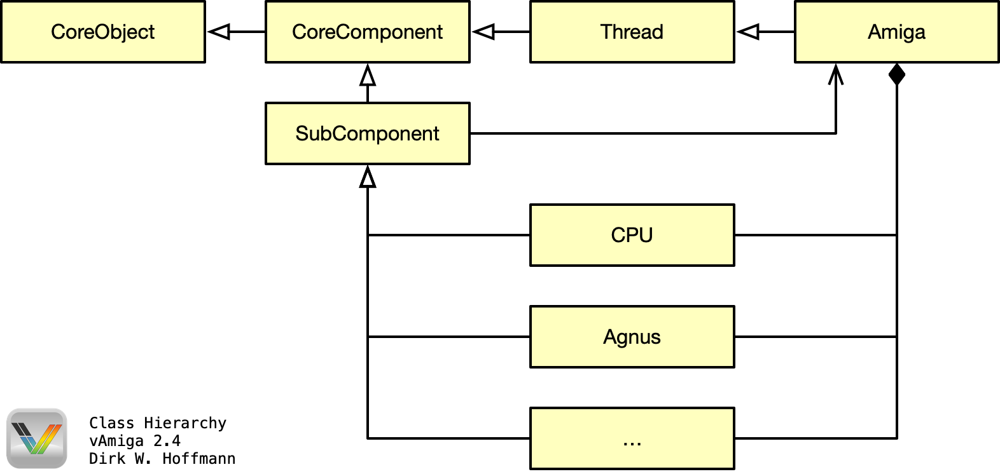

# The Class Hierarchy

This document describes the basic software architecture of vAmiga. The emulator has been written in C++ and is based on the following class hierarchy:



The most prominent class is the `Amiga` class, as each instance of this class represents a complete virtual Amiga. The class inherits from three other classes: 

- `AmigaObject`

  This class encapsulates some common functionality that is useful for most classes in the vAmiga universe. For example, it provides the API functions for printing debug messages.

- `AmigaComponent`

  This class defines the functionality which is shared by all classes representing a hardware component. It includes functions to initialize, configure, and serialize the object, as well as functions to power on, power off, run, and pause. 

- `Thread`

  This class enables the `Amiga` class to run code in a separate thread. The architecture and functionality of this class is covered in a separate document.

Another important entity is the `SubComponent` class, which is the ancestor of all, you guessed it, subcomponents of the Amiga. As a rule of thumb, you'll find a separate class for almost every component you'll find on the motherboard of a real Amiga. There is a `CPU` class, a `Memory` class, and classes for the custom chips `Agnus`, `Denise` and `Paula`. The Blitter and Copper are also encapsulated in individual classes. You'll find the instances of these classes inside `Agnus`, just as you would find the logic circuits of these chips inside the Agnus chip in the real machine.

The inner structure of the `SubComponent` class is very simple, as its main purpose is to make all subcomponents visible to all others. In the class diagram you may have spotted the association arrow that connects the `SubComponent` class with the `Amiga` class: 


In the code, the connection is established in the constructor of the `SubComponent` class: 
````c++
SubComponent(Amiga& ref);
````
Inside the constructor, a number of references like the following are set up: 
````c++
CPU &cpu;
Memory &mem;
Agnus &agnus;
...
````
The references are available in any subclass of `SubComponent` and provide easy access to all subcomponents of the virtual Amiga. For example, whenever Agnus needs to block the CPU for a certain number of cycles, it can do so by calling an appropriate API function on the `cpu` reference:
````c++
cpu.addWaitStates(delay);
````
