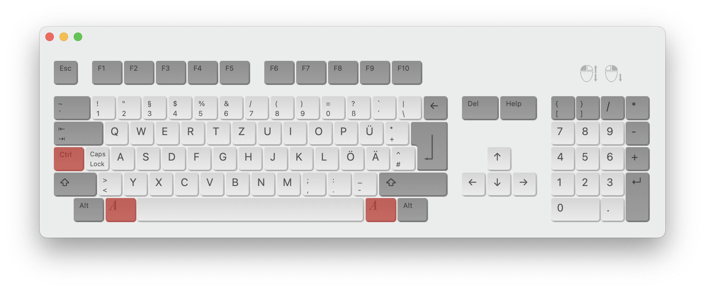
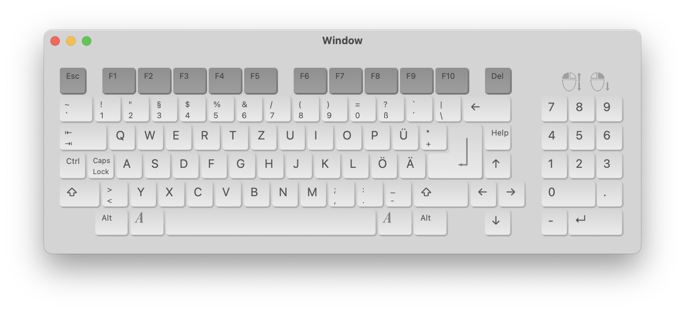
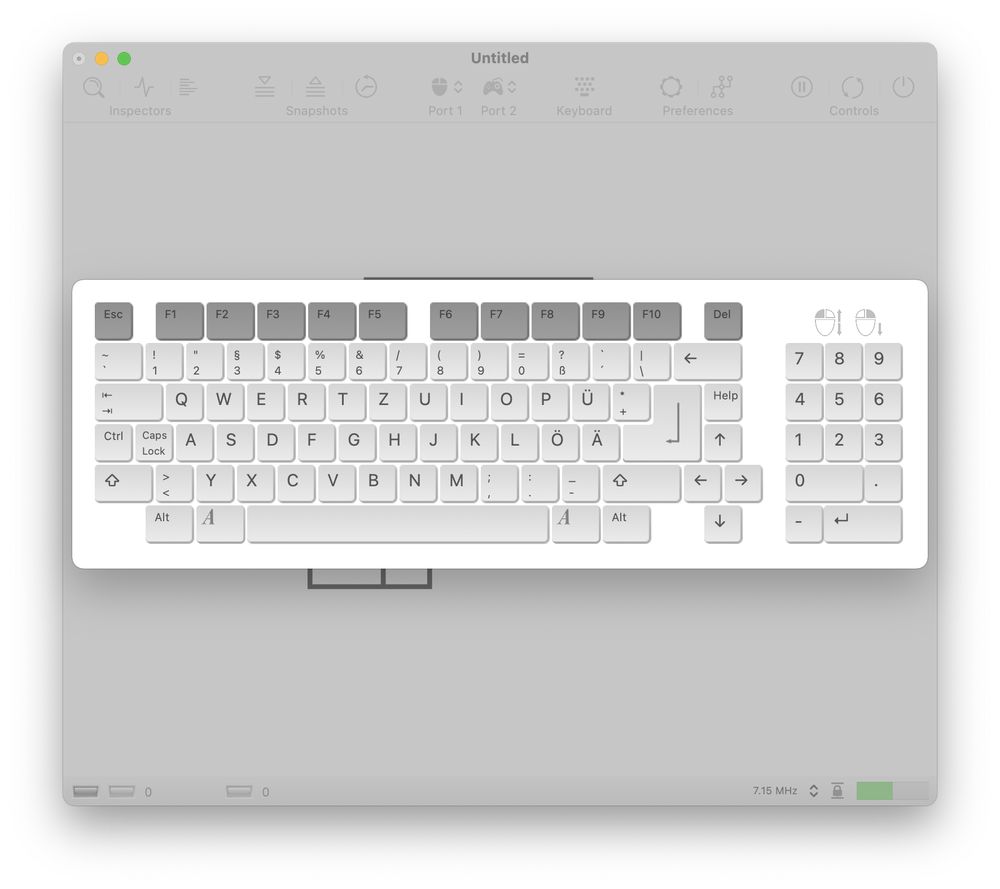

# Using the Keyboard

Although the Amiga is quite an aged computer by now, it already utilized a keyboard whose layout was quite similar to the ones used today. Therefore, in vAmiga you will be using the native Mac keyboard for typing, and for most Amiga keys you will find a perfect match on your native keyboard. However, there are exceptions. For example, the Amiga is equipped with a special help key that has no direct counterpart on the Mac keyboard. Also, some Mac keys are directly linked to operating system actions, which affects emulation. The most prominent examples are the two Command keys that are used to trigger operating system actions.

In cases where you need to press a key that is not directly accessible from your native keyboard, you can use the vAmiga's virtual keyboard. It can be opened permanently via the corresponding option in the keyboard menu:

The virtual keyboard is opened in a separate window:

To press a single key on the virtual keyboard, simply press the corresponding icon with the left mouse button. Clicking with the right mouse button holds down a keys until it is clicked again. This allows the user to press more complex combinations, such as Ctrl-Amiga-Amiga, which resets the computer.

The layout of the virtual keyboard automatically adapts to the current Kickstart Rom. If an Amiga 1000 Boot Rom is installed, the virtual keyboard appears in the form of the old Amiga 1000 keyboard:

A second way to open the virtual keyboard is to use the corresponding icon in the emulator window toolbar. In this case, the keyboard does not open permanently in a separate window. Instead, it opens as a sheet and closes automatically when a key is pressed.

As already stated, macOS relies heavily on the usage of the command keys. Therefore, these keys are not mapped to their counterparts, the two Amiga keys on the Amiga keyboard, by default. However, if you wish to do so, you can establish this mapping by selecting the appropriate entry in the keyboard menu.
