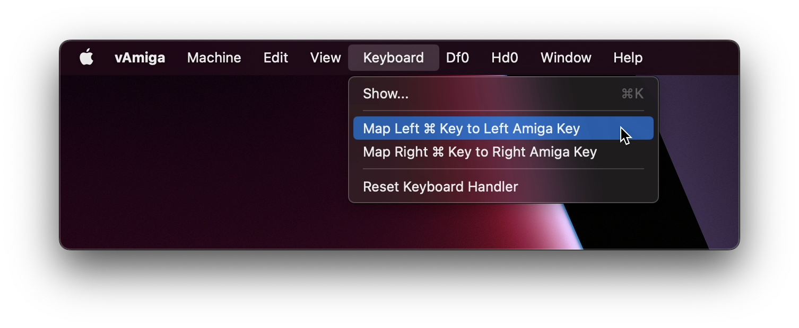

# Mapping the Command keys

In vAmiga you will be using the native Mac keyboard for typing, and for most Amiga keys you will find a perfect match on your native keyboard. This holds true for the two Amiga keys, too. They are located at the same places on the Amiga keyboard as the Command keys are on modern keyboards. Therefore, it would be natural to assign the two command keys to the two Amiga keys. 

However, this creates a problem because the command keys in macOS are directly linked to operating system actions. If we grant the emulator free access to these keys, we would lose all standard key combinations like *Cmd+H* for hiding a window or *Cmd+Q* for quitting the application.

Therefore, the command keys are not mapped by default. However, if you want to associate the command keys with the Amiga keys, you can do so via the keyboard menu. By selecting the appropriate option, you can choose whether you want to map the left command key, the right command key or both keys. 

A feasible tradeoff is to map the right Command key, only, since the Amiga used the right Amiga key to trigger OS-specific commands. If the left command key is left unmapped, you can trigger Amiga commands using the right Command key while still controlling the Mac application with the standard macOS-specific keyboard shortcuts. 
