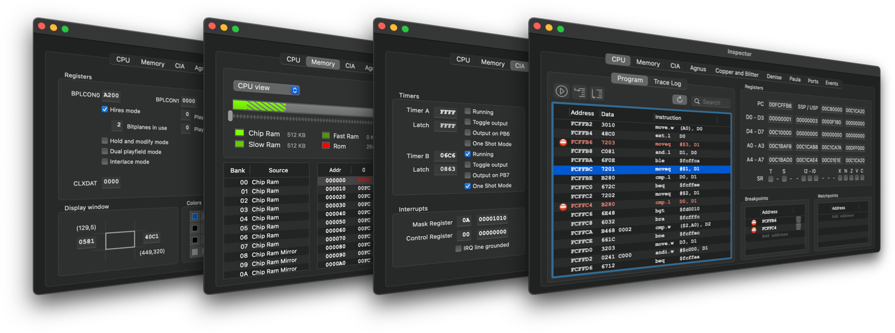

# About

vAmiga is a Commodore Amiga 500, 1000 and 2000 emulator for macOS. Development begun in January 2019 and has made great progress since then.

## Design goals 

I have written vAmiga with three goals in mind:

- **Accuracy**

  vAmiga aims to emulate the three original Commodore Amiga machines, the A500, A1000, and A2000, with very high accuracy. It is tried to emulate all components with cycle-exact accuracy, meaning that each memory access is  performed at the exact same DMA cycle as on the original machine.

- **Usability**

  Providing an appealing graphical user interface is a crucial aspect in retro computing as the purpose of an emulator is not only to run aged software, but to bring back old memories from back in the day. vAmiga provides an easy-to-use interface that tries to hide as many technical details from the user as possible.

- **Quality**

  It is my deep conviction that the code quality is as important as system-level functionality. For this reason, I have spent a lot of time on software architecture and refactoring. The effort already payed off. E.g., it was possible to port vAmiga to WebAssembly with little effort. 

## Licensing

vAmiga is open-source and published under the terms of the GNU General Public License. The CPU core has been re-licensed recently. It is published under the terms of the MIT license now, allowing much broader use. Please refer to the Moira project for more details about this topic.

To run the emulator, a Kickstart Rom is required. Please note that the original Amiga Roms cannot be shipped with the emulator as they are the intellectual property of Cloanto. By purchasing a license of Amiga Forever™ you can acquire legal Kickstart Roms und use them in vAmiga.
