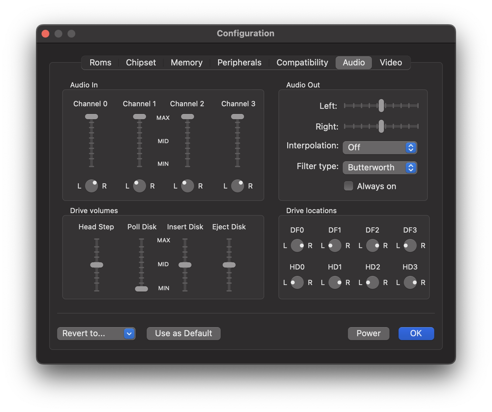

# Audio Panel

Use this panel to change audio settings. 

The audio settings are organized in four sections: 

## Audio In 

This section controls the volumes of the four Amiga audio channels. To mute an audio channel, simply lower the volume to zero. The pan controls can be used to freely distribute each channel to the left and right speakers. By default, channels 1 and 2 are routed to the left speaker and channels 0 and 4 to the right speaker, just like the real Amiga does.

## Audio Out

- **Left**, **Right** 

  The two volume controls change the main volume of the two stereo output streams. Both streams are mixed together from the four Amiga audio channels as specified in the Audio In section. 
  
- **Interpolation**
  
  The Amiga can generate audio streams with different sampling rates. This means that the audio stream must be translated into a suitable audio stream for the host computer. The interpolation settings control how this conversion is performed. You can choose between three methods:
  
  - **Off**

    In this mode, no interpolation takes place. Based on the timestamp of the audio sample to be created, the current content of the audio output buffer is fed into the audio stream of the host computer. This mode trades in quality for speed. 

  - **Nearest**

    Based on the timestamp of the audio sample to be created, the Amiga audio sample with the closest timestamp is selected. This mode is slightly slower than the first one, but produces better quality. 

  - **Linear**

    Based on the timestamp of the audio sample to be created, the two surrounding samples are looked up in the Amiga audio stream and linearly interpolated. This mode gives the best result, but is also the slowest among the three options.

## Drive volumes 

In this area, the volumes of several sound effects are controlled. vAmiga distinguishes between heads steps and polling clicks. The latter describe the steps of the drive head that are executed to detect a disk change. Since polling clicks may become annoying, especially when two or more drives are connected, it is possible to silence them by reducing the volume of the polling clicks to zero. All normal head movements will still be audible in this case.

## Drive locations 

With the pan controls you can freely distribute the drive sounds to the left and right speaker outputs. In the default setting, all sounds from the internal floppy drive are routed to the right speaker, since the floppy drive in the Amiga 500 is located on the right side of the computer case. 
