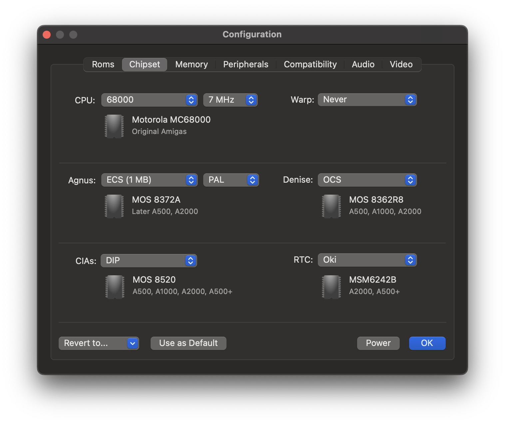
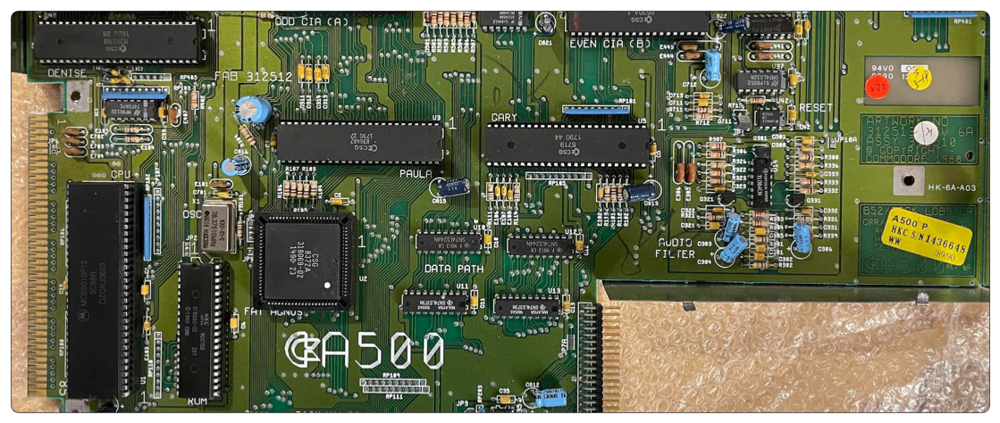

# Chipset Panel

Use this panel to configure the CPU and custom chips of the virtual Amiga.

## CPU

vAmiga supports three different CPU revisions:

- **M68000**

  The M68000 is a 16/32-bit CISC microprocessor introduced by Motorola in 1979. Commodore has used this CPU in all classic Amiga models. Choose this revision to emulate the classic Amigas at highest precision. 

- **M68010**

  The MC68010 processor was released in 1982 as the successor to the Motorola 68000. It was never officially used by Commodore in any Amiga model. However, since the M68010 was pin-compatible with the M68000, it can be used as a replacement for the M68000 in all classic Amigas. The following image shows one of my test machines that has been upgraded with an M68010. I've used this machine extensively while adding M68010 support in vAmiga: 

  

  Using the M68010 instead of the M68000 results in a speed gain of about 10%. Among other things, this is due to a special operating mode, called *loop mode*, which is entered automatically when certain loop constructs are executed. In this mode, some redundant memory accesses are skipped, resulting is faster execution speed. Please note that the M68010 is not 100% software compatible with the M68000. Therefore, some games or demos may not work when this CPU is selected. 

- **68EC020**

  The M68EC020 is a lower-cost version of the Motorola 68020 processor, which was launched in 1984. It was used by Commodore in the Amiga 1200 with a clock frequency of 14MHz. The 68020 was a significant improvement over the M68010, as it was the first CPU in the M68k series to have an on-board cache. vAmiga emulates the M68EC020, but with less precision than the M68000 and M68010. The first two models can be emulated by vAmiga with exact cycle precision, which means that all instructions not only consume the proper number of CPU cycles, but also access memory during the exact same DMA cycle as the real machine does. In 68020 mode, the CPU is emulated with lower accuracy. For example, vAmiga does not emulate caching, yet.

The next two options choose the emulated chip revisions of Agnus and Denise, two of the so-called *custom chips*. These chips were extremely important for the Amiga, as they were one of the main reasons for its competitive computing power back in the day. Without the custom chips, the Amiga would never have taken the prominent place in computer history it occupies today.

All custom chips can be classified into one of three generations. The first chip generation is called OCS (Original Chip Set). All original Amigas were equipped with these chips. The second generation is called ECS (Enhanced Chip Set) and was used by Commodore in the A500+ and the A600. Some ECS chips were also used in later revisions of the A500 and the A2000. Commodore shipped them with an ECS Agnus and an OCS Denise. My test computer pictured above also belongs to these models. It is equipped with an Agnus 8372A, a revision of the ECS generation. Denise, however, has revision number 8362R8, which is the OCS version of this chip.
The third generation of custom chips was called AGA (Advanced Graphics Architecture). Commodore equipped the A1200 and A4000 with these chips.

Both the OCS and ECS chipsets are supported by vAmiga. The AGA chipset is currently *not* supported and probably will never be.

## Agnus

Agnus can be considered the boss among the custom chips, because it controls the interaction of all other components. It also acts as a data provider for the other chips, as it performs all DMA accesses.

vAmiga is able to emulate the following revisions of this chip:

- **Early OCS**

  This option emulates the MOS 8367. It was used in the A1000 and in a very early version of the A2000, usually called the A2000A.

- **OCS** 
  
  This option emulates the MOS 8371 which was used by Commodore in many revisions of the A500 and A2000. It is the most commonly used OCS version of this chip.

- **ECS (1MB)**
    
  This option emulates the MOS 8372A. It is the first ECS revision of this chip. Apart from some minor details, the ECS variant differs mainly in the size of the addressable memory space. While the OCS models can only address 512 KB of Chip Ram, the ECS version was capable of addressing twice as much. 

- **ECS (2MB)**

   This option emulates the MOS 8375, which increased the range of addressable Chip Ram to 2 MB. It is used in the A500+ and A600, released in 1991 and 1992 respectively.

## Denise 

- **OCS**

  This option selects the MOS 8362R8 which was used in all revisions of the Amiga 1000, Amiga 500, and Amiga 2000. 

- **ECS**

  This option selects the MOS 8373R4. The chip is sometimes referred to as *HiRes Denise* and was used in the Amiga 500+ and the Amiga 3000. Compared to its predecessor, it supports additional graphics modes and features an advanced sprite unit. It also offers a special *Border Blank* mode, which causes the border to be drawn in black color instead of the currently selected background color. Some games use this feature to surround the drawing area with a nicer looking border.

## CIAs

  The Amiga utilizes CIAs of type MOS 8520 to interact with peripheral devices. These chips are similar to the well-known MOS 6526 revisions used in the C64. However, there are subtle differences. For example, Commodore replaced the TOD clock with a native 24-bit counter and supplied the CIA timers with an autostart mechanism.

- **DIP**

   This option selects the DIP version of the MOS 8520. The DIP models are the default option as they were used in all classic Amigas. 

- **PLCC** 

   This option selects the PLCC version of the MOS 8520, which was used e.g. in the Amiga 600. The differences to the DIP version are extremely subtle.

## RTC

The term RTC refers to the Amiga's real-time clock. The first Amiga, the Amiga 1000, never shipped with such a device and it was quite cumbersome to add one. For the Amiga 500, adding an RTC was easy, as many trapdoor memory expansion cards shipped with such a device on board. They are easily recognized by the battery needed to keep the register contents alive. In the Amiga 2000, the real-time clock was soldered directly to the motherboard. In hindsight, this was a bad idea, as the battery, which was also soldered directly to the motherboard, is now the number one death bringer of such machines. Many of us have lost our beloved devices because of the damage caused by the acid of a leaking battery.

vAmiga offers the following configuration options:

- **None**

  If this option is selected, no real-time clock is emulated.

- **Oki**

  This option emulates a real-time clock of the type MSM6242B, manufactured by Oki Semiconductor. Commodore used this chip in the A2000 and the A500+.

- **Ricoh**

  This option emulates a real-time clock of type RF5C01A, manufactured by Ricoh, Ltd. Commodore used this chip in the A3000 and the A4000. 
