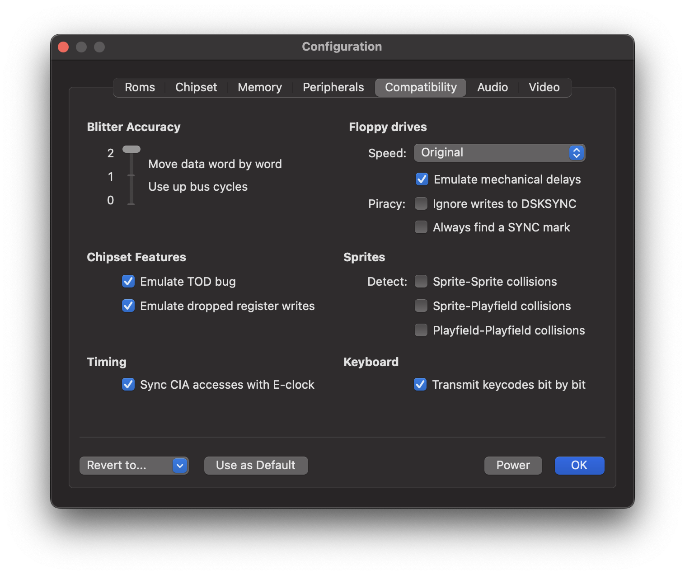

# Compatibility Panel

Use this panel to configure emulation accuracy. 

## Blitter accuracy

Amiga supports three Blitter accuracy levels. Level 0 is the fastest option. In this mode, all data is moved together in a single chunk when the **BLTSIZE** register is written. Although this option is far from being accurate, many games do work with this option. In level 1, the Blitter also moves the data in a single chunk, just as in level 0. However, bus timing is emulated afterwards. This means that vAmiga blocks the data bus in the exact same cycles as the real Blitter would. Level 2 is recommended in all scenarios where high accuracy is required. In this mode, the Blitter is emulated cycle by cycle. It transfers data in the exact same cycles as the real Blitter would.

## Chipset Features

- **Emulate TOD bug**

  The Amiga CIAs exhibit a bug in the circuitry of the 24-bit counter, commonly referred to as the TOD bug. The bug is part of the increment logic which can falsely trigger a TOD interrupt. This happens when the alarm value matches the counter values at the time when the lowest three nibbles finished to increment.

- **Emulate dropped register writes**

  Under certain circumstances writing to a DMA pointer register has no effect. On a real Amiga this happens when the pointer register has been used internally exactly one cycle before the update would happen. If you enable this option, vAmiga will check for the drop condition and abort the write operation if necessary.

## Timing

- **Sync CIA accesses with E-clock**

  Both Complex Interace Adapters (CIAs) are driven by the so-called *E-clock*, a special signal that is output by the CPU with a frequency equal to one tenth of the native clock rate. Before the CPU can read or write a CIA register, it must synchronize with the E-clock, which slightly slows down program execution. If you disable this option, synchronization with the E-clock is skipped. In this case vAmiga can access CIA registers as fast as all other memory cells.

## Floppy drives

- **Speed** 

  vAmiga offers two different DMA modes for floppy drives: Standard DMA mode (compatible, but slow) and Turbo DMA mode (fast, but less compatible). 
  
  - **Standard DMA mode**
  
    In standard DMA mode, vAmiga performs three DMA accesses per scan line, just like the original Amiga. To speed up, drives can be operated with an acceleration factor. In this case, the emulator transfers multiple words in a single DMA slot, something the original machine obviously can't do.

  - **Turbo DMA mode**
  
    Turbo DMA is applied when the drive speed is set to *Infinite*. In this mode, data is transferred immediately when the DSKLEN register is written to. Although this mode is far from precise, many games and demos can be run in this mode without any issues.
  
- **Emulate mechanical delays** 

  When this option is enabled, vAmiga applies more stringent timing. That is, it emulates the acceleration and deceleration phases of the drive motor as well as the delay caused by the movement of the drive head from one cylinder to the next.

- **Piracy** 

  These options are rarely needed, but can help to bypass copy protection mechanisms. 

  - **Ignore writes to DSKSYNC**

    This option locks the DSKSYNC register. This means that any attempt to change the default SYNC word will be ignored by the emulator.
    
  - **Always find a SYNC mark**
    
    This option instructs vAmiga to issue a disk sync interrupt even for tracks that do not contain a SYNC word.

## Sprites

- **Collision detection** 

  vAmiga allows to disable the collision checking circuity, which is part of Denise. By default, collision checking is disabled because it is expensive to emulate in software and is only needed by a few titles (e.g. Archon and Rotor).

  vAmiga allows to disable the collision checking circuity which is part of Denise. By default, collision checking is disabled because it is expensive to emulate and only needed by a very few titles such as Archon or Rotor.

### Keyboard 

- **Transmit key codes bit by bit**

  The keyboard is a central input device of the Amiga. While Commodore had equipped the Amiga 1000 and the Amiga 2000 with an external keyboard, they decided to integrate the keyboard directly into the case of the Amiga 500. This was only an aesthetic difference, though, as the connection to the motherboard was always the same. The keyboard first generates a key code for each pressed key. After that, it sends the code bit by bit to one of the two CIAs. As soon as the last bit is received, an interrupt is generated and the interrupt handler takes over. By enabling this option, vAmiga emulates the bit-by-bit transmission exactly as described. Disabling this option tells vAmiga to skip the transmission phase and to write the generated keycode directly into the corresponding CIA register. This speeds up emulation, but is less accurate.