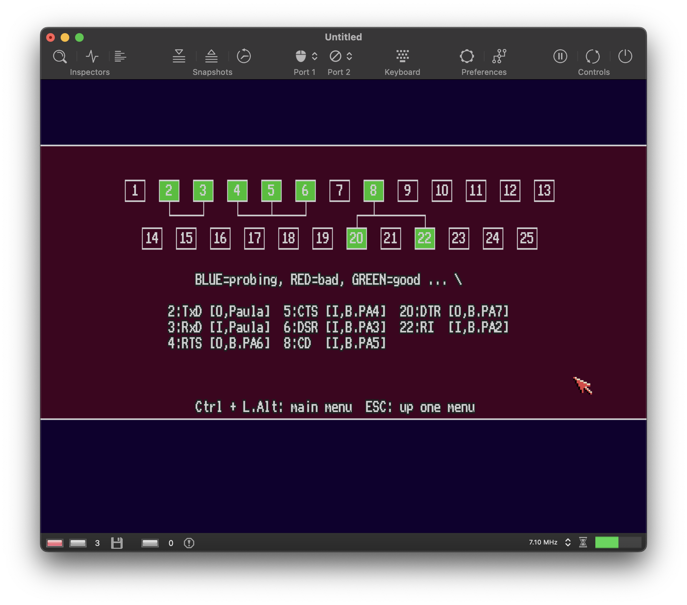

# Peripherals Panel

Use this field to set up peripheral devices. 

## Floppy Drives

Just like a real Amiga, vAmiga supports up to four floppy drives. The internal drive is labeled Df0 and always present. The external drives are labeled Df1 to Df3. The internal drive is a 3.5" double-density drive providing a storage capacity of 880 KB per floppy disk. The external drives can be configured as double-density drives like the internal drive, or as high-density drives which provide twice the storage capacity. Back in the day, many users, including myself, had an external 5.25" floppy drive connected to their Amiga, mainly because of the much lower price of 5.25" floppy disks. However, such drives only offered a reduced storage capacity of 440 KB. Such single-density drives are not yet supported by vAmiga and will probably never be. 

## Hard Drives

Thanks to Michael Rasmussen, vAmiga is able to emulate hard drives. Up to four hard drive controllers are supported. Each controller occupies a Zorro II slot and identifies itself to the Amiga via the AUTOCONFIG mechanism at boot time. 

## Game Ports

The Amiga is equipped with two game ports for connecting input devices such as joysticks or mice. The connected input device can be selected via a popup menu. By default, vAmiga offers you to leave the port empty, to connect the internal mouse or to connect a keyboard-emulated joystick. If an external mouse or a compatible gamepad is present, the device is shown as another option in the popup menu.

## Serial Port

vAmiga offers the following options for the serial port: 

  - **No Device**

    No device is attached. This is the default option. 

  - **Null Modem Cable**

    vAmiga is capable of emulating a null modem cable. By opening two instances of vAmiga on your computer, you can connect them via the null modem cable and play e.g. a nice game of Battle Chess with two Amigas fighting each other. 

  - **Loopback Cable** 

    A loopback cable connects the output pins of the serial port with its input pins. Such a cable is required, e.g., to run the serial port test built into **Amiga Test Kit**: 

    
