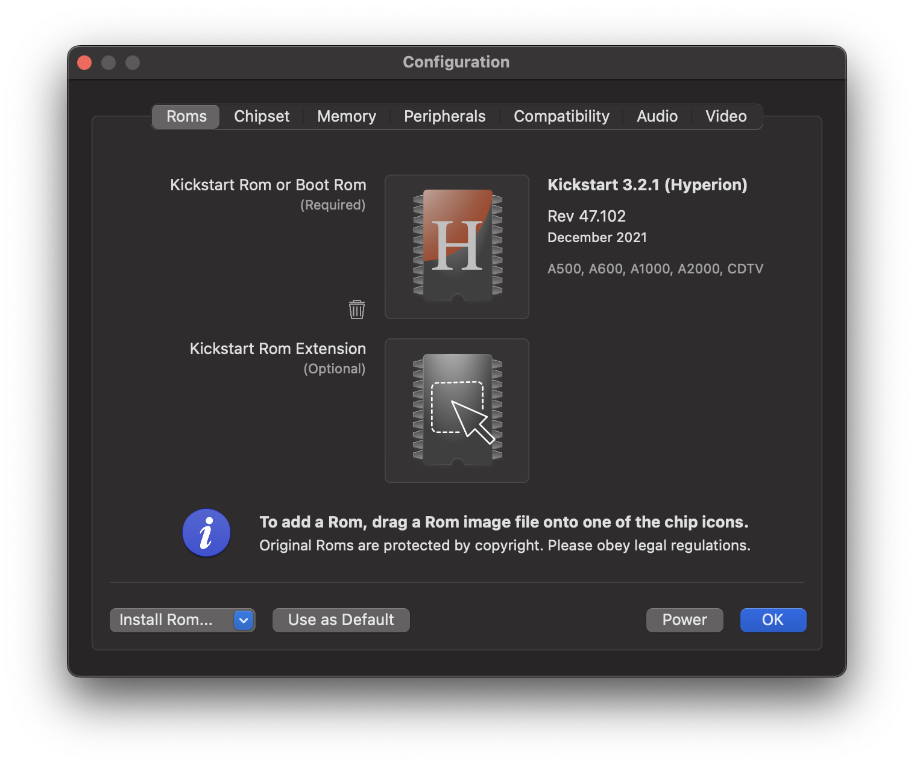

# Rom Panel

Use this panel to add Rom images to the emulator. 

If vAmiga is started for the first time, you will be directed directly to this panel. This panel takes care of the most important configuration option, the selection of the Kickstart Rom. 

## Kickstart Rom

Rom images are installed via drag and drop. To install a Kickstart Rom, simply drop a Rom image into the upper drop box. Right after an image has been dropped, vAmiga performs two checks. The first check consists of testing some magic bytes. If the byte sequences are unknown to the emulator, the Rom image is rejected. Otherwise, the next check is performed. In the second phase, vAmiga compares the CRC checksum of the Rom image against a small database. If the Rom is known, it displayes it's name and some other basic information. In the screenshot above, you can see that vAmiga has detected that the installed Rom is an original Commodore Kickstart 1.3. If the CRC checksum is unknown to the emulator, vAmiga classifies the Rom as *unknown*. You can still launch the emulator with it, but there is no guarantee if the Rom is compatible or not.

Please note that vAmiga does not come with any an original Commodore Rom. All Amiga Roms are the intellectual property of the company Cloanto and are distributed for a fee. However, if you have purchased a Kickstart Rom legally, you can use it in vAmiga without difficulty.

If you don't have an original Kickstart at hand, you have the option to install an Aros replacement Rom. Two revisions of the Aros Rom are bundled with the emulator. For easy installation, open the drop-down menu in the lower left corner of the panel. The replacement Rom is an open-source kickstart variant that is freely redistributable. Please be aware that not all Amiga programs are compatible with the replacement Roms. To achieve high compatibility, we therefore recommend the purchase of the original Roms.

## Extension Rom

Should you decide to use the Aros Roms, you may notice that the Amiga has two different Roms installed. This is due to the size of the Aros Rom, which significantly exceeds the maximum size of 512 MB. For this reason, the Aros Rom has been split into two separate Roms. The first one appears in memory at the same addresses as the original Kickstart Rom. The second one appears in address range $E00000 - $E7FFFF. 

Rom extensions can also be installed manually by dropping an Rom image into the corresponding drop box. Unlike the Kickstart Rom, which is always mapped in the same address range, the extension Rom can be mapped to different location in memory. As stated above, the Aros extension Rom needs to be mapped at $E0000 to work. Other extension Roms, however, need to be appears in address range $F00000 - $F7FFFF. In these cases, you can set the address range manually by selecting the memory range from the drop down box next to the extension Rom drop box. 

The original Commodore Roms of the Amiga 500, 1000, or 2000 fit into a single chip. If you opt to use the orignal Roms you can leave the extension Rom slot empty. 
