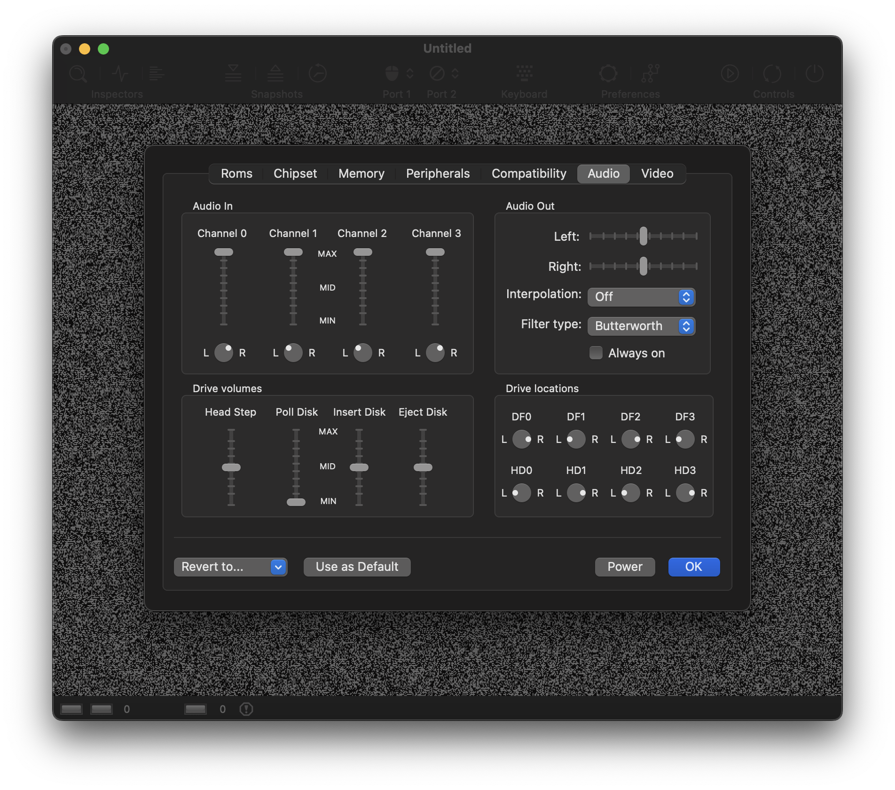

# Audio Panel

Use this panel to change audio settings. 

The audio settings are organized in four sections: 

## Audio In 

In this section, the volume of all four Amiga audio channels is specified. To remove an audio channel, simply lower the channel volume to zero. Using the pan control knobs, each channel to be freely distributed between the left and right speakers. The default setting route channel 1 and 2 to the left speaker and channel 0 and 4 to the right speaker, just as a real Amiga does. 

## Audio Out

- **Left**, **Right** 

  The two volume sliders change the master volume of the two stereo output streams. Both streams are composed out of the four Amiga audio channels as specified in the Audio In section. 

- **Interpolation**
  
  The Amiga can produce audio streams with varying sample rates. This means that the audio stream needs to be translated to a suitable audio stream for the host computer. The Interpolation settings controls how this translation is done. You may choose among three methods:
  
  - **Off**

    In this mode, no interpolation takes place. Based on the time stamp of the audio sample to create, the current contents of the audio output buffer is copied into the audio stream of the host machine. This mode trades is quality for speed. 

  - **Nearest**

    Based on the time stamp of the audio sample to create, the Amiga audio sample with the closest time stamp is selected. This mode is slower than the first one, but produces an audio stream of better quality. 

  - **Linear**

    Based on the time stamp of the audio sample to create, the two surrounding samples in the Amiga audio samples are looked up and interpolated linearly. This mode produces the best result, but is the slowest among the three options.

## Drive volumes 

In this section, the volumes of multiple sound effects can be controlled. vAmiga distinguishes between heads steps and polling clicks. The latter describe the heads steps that are performed to detect a disk change. Because polling clicks can become very annoying, especially when two more drives are connected, it's possible to silence them by lowering the volume of polling clicks to zero. All normal head step movements will still be audible in this case. 

## Drive locations 

Using the pan control knobs, you can distribute the drive sounds freely among the left and right speaker output. In the default setting, all sounds of the internal floppy drive are routed to the right speaker, because this is where the floppy drive is located in the Amiga 500. 