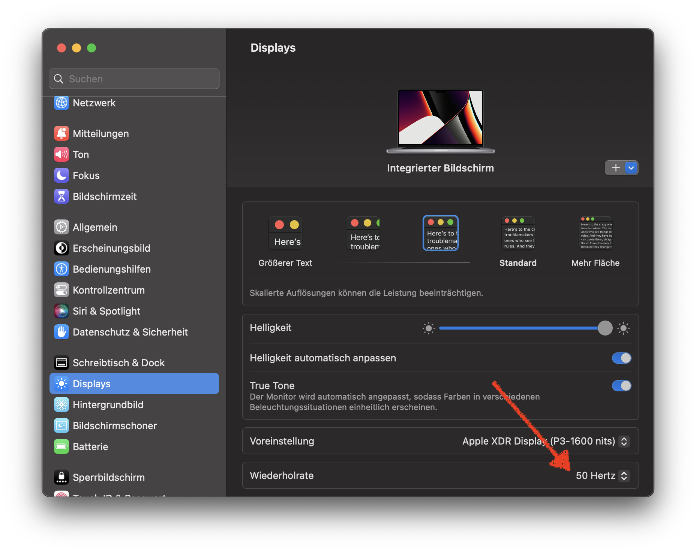
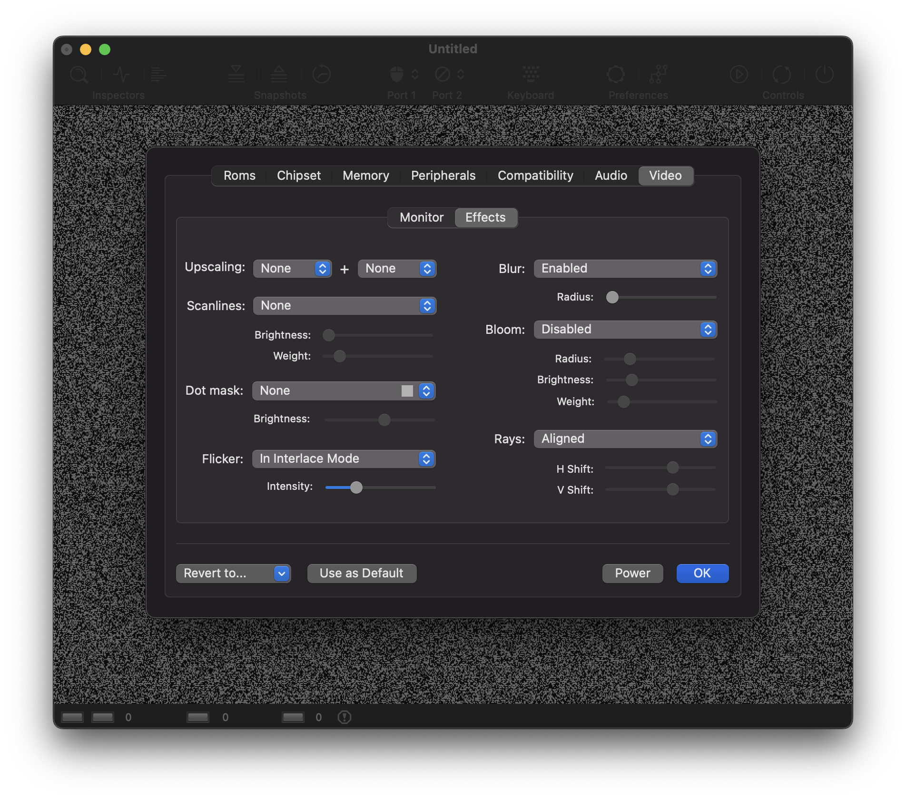

# Video Panel

Use this panel to change video settings. The video panel is split into two sub-panels: The *Monitor panel* allows to adjust basic image properties, visible screen area, and sync mode. The *Effect panel* controls allows to control texture upscaling and to enable various effects for mimicing the look and feel of CRT displays from back in the day.

## Monitor 

  

### Palette

  This option selects the monitor type. Besides emulating a color monitor, which is the default option, different kind of uni-color displays can be emulared such as Amber or Green displays. Like on a real monitor from back in the day, you can adjust three parameters which affect the color palette: *Brightness*, *Contrast*, and *Color*.

  

 ### Zoom

  The zoom level defines the visual screen area and can be modified manually for the horizontal and vertical axis. The drop-down menu offers some pre-defined value sets you may choose from. 

 ### Center

  Whereas the zoom level defines the dimensions of the visible screen area, the two centering parameters define the location of it's center point. Please note that changing the centering paramerer has no effect if the zoom level is zero. In this case, the visible screen area equals the entire texture which makes it impossible to move the center point around.
    
 ### Refresh

  vAmiga supports two methods for synchronizing the emulator thread. The default method is based on timers. In this mode, the emulator puts itself to sleep after a single frame has been emulated. When the thread wakes up, the next frame is computed and so on. This is method is the most flexible as it allows the emulator an arbitrary number of frames per second. I.e., vAmiga computes 50 frames per seconds in PAL mode and 60 frames per seconds in NTSC mode. This methods comes with a caveat though. Because the emulator thread is not synchronized with the graphics loop, somes frames might either be dropped or displayed twice from time to time. 
    
  In video games, a common method to tacke this problem is to let the graphics loop trigger the frame computation. This method is usually refered to as VSYNC mode, because the image provider and the graphics loop work no longer independently of each other. If VSYNC is enabled in vAmiga, something similar happens. The emulator thread does no longer set a timer to wake up the emulator thread. Instead it waits for a wakeup signal from the graphics backend. As a result, the number of requested frames will match up precisely with the number of drawn frames. However, this methods has caveats, too. Because a modern TFT display usually refreshes at 60Hz, vAmiga will be requested to compute 60 frames per second. This is fine for NTSC, but not for PAL. If a PAL machine is emulated in this mode, it will run slightly faster than the original machine would. 

  On modern Macs, however, this problem is easy to solve. With the introduction of the ProMotion technology, the Mac can be configured to refresh at custom refresh rates. On such Macs, the standard refresh rate can be lowered to 50 Hz in the system settings. As a result, the Amiga will run at it's native speed again. 

  

## Effects

  vAmiga utilizes a sophisticated graphics pipeline which allows to manipulate the emulator texture in various ways. 

  

### Upscaling

  vAmiga's GPU pipeline includes two pixel-upscaling stages. In the first stage, in-texture upscaling is applied which means that the texture size remains unchanged. The upscaling algorithm is only applied to lines drawn in lores mode. The second stage is a more traditional upscaling phase which doubles the texture size. In this stage, the selected upscaling algorithm is applied to all emulator pixels, no matter if they were drawn in lores or hires mode. For each stage, the upscaling algorithm can be selected independently. Right now, vAmiga supports the EPX and xBR upscaling algorithms. If no upscaling is desired, one or both phases can be disabled. 

  
  

### Scanlines

  Three scanline modes are supported: *None*, *Embedded*, and *Superimposed*. In *Embeded Scanline Mode*, scanlines are emulated by lightening and darkening every second scanline inside the emulator texture. This method has the drawback of generation Moiré pattern. To avoid these pattern, the height of the emulator window has to be adjusted such that every line of the emulator texture will be mapped to a distinct line on the native display. The height can be adjusted automatically by selecting menu item *Adjust* from the *Window* menu. 

  If scanlines are generated in *Superimposed* mode, the scanlines are generated inside the fragment shader. The fragment shader is applied very late in graphics pipeline and works on the final texture. As a result, Moiré effects are no longer possible. On the negative side, the scanline dimensions are now independent of the height of the emulator window which that the number of displayed scanlines does no longer match what would be seen on a real CRT monitor.

  
  

  ### Dot Mask

  vAmiga can emulate various dot masks patterns to immitate the small red, green, and blue dots that are used by a real CRT monitor to compsose the image.

  
  

  ### Flicker

  PAL or NTSC displays are design to transmit the image in form of 50 or 60 fields per second. Two fields compose a frame as one of the two field contains all even lines and the other fiels all odd lines. This results in an output rate of 25 frames for PAL and 30 frames for NTSC. In standard display modes, the Amiga uses the same pixel information for both fields which results in a stable picture at 50 or 60 Hz. However, the Amiga had the ability to double the vertical resolution by outputting completely different pictures in both frames. These mode are called interlace modes. Because both picture now only repeats 25 or 30 times per second, the image flickers for the human eye. 

  vAmiga is emulate to flickering in different intensities. Back in the day, flicker fixer was a popular product. By buffered the video image it was able to create a smooth image at double vertical resolution. To immitate what the flicker fixer did back then, simply disable flicker emulation. 

### Blur

  If this option is enabled, vAmiga adds another stage to the graphics pipeline which applies a Gaussian blur filter to the upscaled image. 

  
  

### Bloom

  When a bright white object is displayed on a dark background, the white light spreads out a bit at when displayed on a CRT monitor. As a result, the object looks like as it slightly glows. This effect is known as *blooming* or *glowing*. By enabling this option, vAmiga tries to replicate this effect. 

  
  

### Rays

  A CRT tube uses three seperate electron beams, one for each color channel. Each electron beam creates a seperate color. When the electron beams are aligned, the color layers appear to be stacked precisely on top each other. When the electron beams get disaligned, color artifacts are produced as the three color layers are shifted against each other now. vAmiga is able to emulate this effect with different intensity. 

  
  
