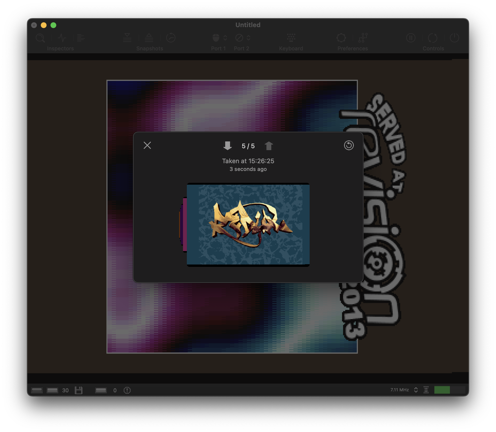
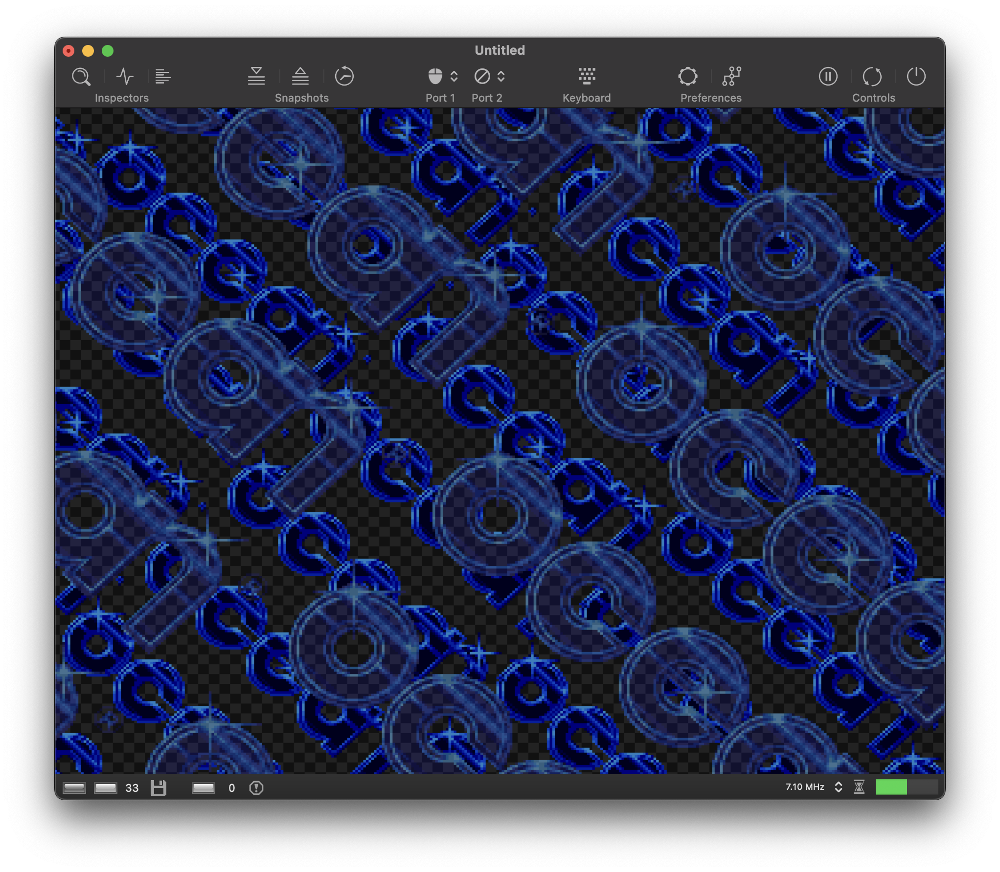
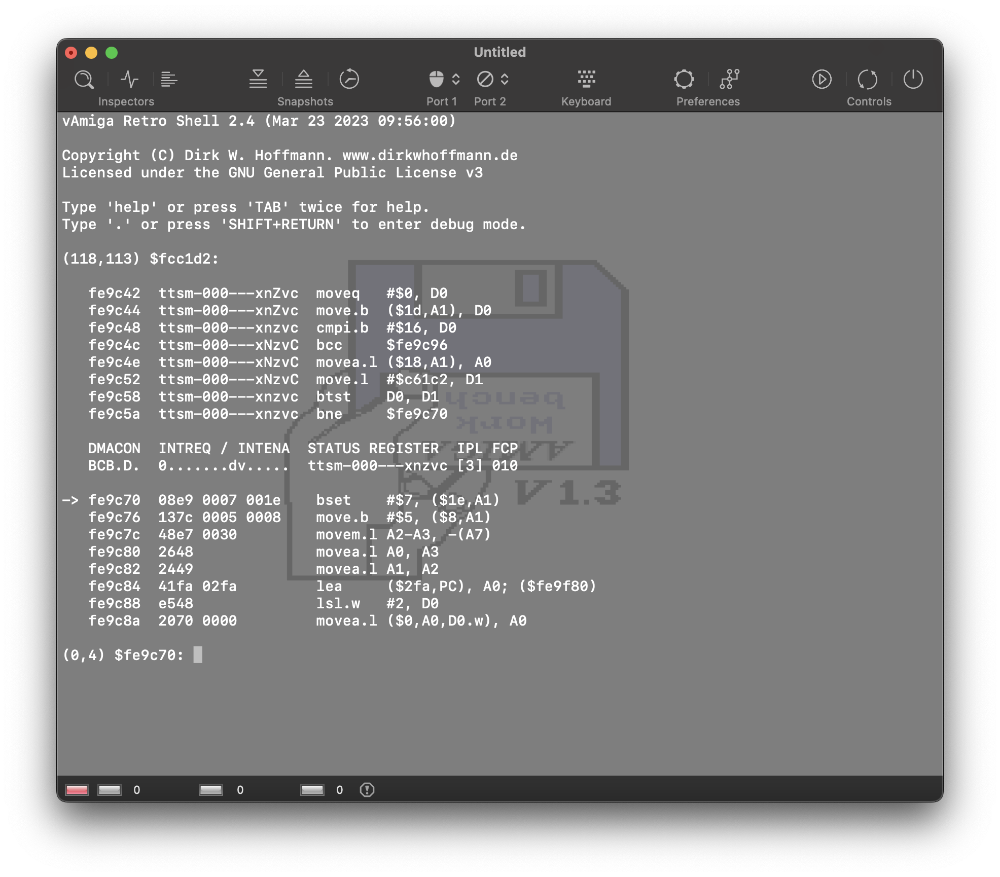

# Exploring the User Interface

In this tutorial, we will explore the most commonly used elements of the vAmiga user interface. 

## Toolbar

Many of the basic emulator properties can be controlled via the toolbar, which defaults to the following:

We will review the elements of the toolbar one by one.

### Controls

The three buttons in the *Control* section allow us to control the emulator state:

The functionality of these buttons is what you might have already guessed:
- The left button pauses or resumes emulation. 
- The middle button performs a hard reset. 
- The right button switches the Amiga on or off.

### Preferences

The two buttons in the *Preferences* section let us configure vAmiga. The left button opens the *emulator settings* window, which manages the settings that apply to all emulator instances simultaneously.

All available options are described in a separate document. For the purpose of this tutorial, we do not need to change anything here and can proceed to the next point right away. 

The right button opens the Configurator window where the virtual machine is configured. The options are organized in tabs, similar to the emulator settings window. You are already familiar with the first tab if you have read the *Getting started* tutorial. It is the tab where the Rom of the Amiga is configured. 

All available options are described in a separate document. Please note that all settings made in the Configurator are specific to a single emulator instance. Therefore, it is possible to run two emulator instances with different configurations side by side.

### Keyboard

Although the Amiga is quite an aged computer by now, it already utilized a keyboard whose layout was quite similar to the ones used today. Therefore, in vAmiga you will be using the native Mac keyboard for typing, and for most Amiga keys you will find a perfect match on your native keyboard. However, there are exceptions. For example, the Amiga is equipped with a special help key that has no direct counterpart on the Mac keyboard. Also, some Mac keys are directly linked to operating system actions, which affects emulation. The most prominent examples are the two Command keys that are used to trigger operating system actions.

In cases where you need to press a key that is not directly accessible from your native keyboard. If you click the corresponding icon in the toolbar, the virtual keyboard will open as a sheet on top of the emulator window:

The keys on the virtual keyboard can be clicked with either the left or the right mouse button:

- **Left Button**

  When the left moused button is used, the selected key is pushed down and automatically released after a short delay. Use this option if you wish to press a single key on the keyboard.

- **Right button**

  When the right mouse button is used, the selected key is permanently pushed down or permanently released if it was pushed down. Use this option if you want to press a specific key combination, e.g. the reset combination *Ctrl+Amiga+Amiga* as shown in the screenshot. 

As soon as a key is pressed with the left mouse button, the virtual keyboard disappears. However, it is also possible to open the virtual keyboard as a separate window that can reside next to the emulator window. To open the virtual keyboard as window, press *Cmd-K*, the key equivalent for the *Show...* item in the *Keyboard* menu. 

### Game Ports

The two gameport icons allow us to quickly switch between the input devices connected to the gameports of the Amiga.

All available devices are displayed in a popup menu: 

The mouse refers to the Mac's internal mouse. Note that the Mac does not distinguish between the mouse and the touchpad. This means that both devices cannot be used independently. The next two items refer to keyboard-emulated joysticks. vAmiga differentiates between two sets of keys, which can be configured in the emulator settings. The last two items are placeholders, which are currently grayed out. As soon as a compatible gamepad is connected to the host, e.g. a compatible USB joystick, the new device will appear in one of the placeholder slots.

### Snapshots

The three toolbar icons in this section can be used to manage snapshots. Snapshots are frozen emulator states that can be restored at a later time. 

- The left button creates a snapshot and puts it in the snapshot storage.
- The middle button reverts to the emulator state recorded in the most recent snapshot. 
- The right button opens the snapshot browser.

  

   The snapshot browser is to vAmiga what *Time Machine* is to the Mac. It lets us browse through the snapshot memory in a graphical way.

Please note that snapshots are not stored permanently. The next time you start vAmiga, you will start over with an empty snapshot storage. This is because snapshots were originally intended as a safe-point mechanism for mastering difficult games. Snapshots were never intended for long-term preservation of emulator states, and never will be, although many users would like to use them that way. The reason is that snapshots do not only contain Amiga specific data like the Ram contents or the values of CPU registers. It also contains the values of many emulator-specific variables that have no direct equivalent on the real machine. The set of internal variables usually changes from release to release, and so does the snapshot format. Therefore, you can almost be certain that snapshots taken with the current version of vAmiga will no longer work when the next version comes out.

### Inspectors

A major design goal of vAmiga was to make the emulated Amiga as transparent as possible. To achieve this goal, vAmiga offers a number of tools that give the user insight into the Amiga's internal workings. The *Inspectors* section of the toolbar grants access to these tools.

#### Inspector Panel 

The Inspector is the primary place to retrieve information about the current state of the emulator. It provides several tabs where the current state of various components can be examined. The first tab is the CPU tab, which looks like this: 

The panel displays the currently executed program and the contents of all CPU registers. The CPU panel is also the gateway to the CPU debugger. We can use it to single-step through the currently executing instruction stream or to set breakpoints and watchpoints. 

#### Monitor Panel

The monitor panel provides additional debugging aids:

The left column contains the controls for the DMA debugger, which can be used to visualize all memory bus accesses in real time. When enabled, the emulator texture is overlaid with an additional graphics layer that visualizes the bus owner for chip or slow ram accesses. The following screenshot shows a scene from Rink a Dink with the DMA debugger enabled.  

The yellow and brown dots represent Copper and Blitter accesses, respectively. The red dots mark the memory refresh cycles and the pink dots the DMA slots for transferring audio data. Bitplane DMA is visualized in cyan. The scene reveals a lot about the inner workings of this demo. The creators decided to use a very small bitplane window that just covers the polygon. This bitplane window is permanently relocated as the polygon moves. [This small YouTube video](https://www.youtube.com/watch?v=aDFVwy4gTaE) shows what *Rink a Dink* looks like when run in vAmiga with the DMA debugger enabled. If you don't want to watch the entire video, you can fast forward at 1:20. Here you can see the animated polygon in action.

The center area of the monitor panel controls the so-called *activity monitors*. When activated, the texture of the emulator is overlaid with small displays giving insight into the activity of various Amiga components:

The elements in the right column control the stencil feature. With this feature vAmiga is able to erase certain graphic layers. For example, it is possible to remove all pixels of a certain playing field or to remove all pixels of a certain sprite. The removed pixels are replaced by the pixels of a checkerboard pattern that looks like it shows through holes in the emulator texture, especially in animated scenes. 

The elements in the right column control the stencil feature. With this feature, vAmiga is able to wipe out certain graphics layers. For example, it is possible to remove all pixels of a certain playfield or sprite. The removed pixels are replaces by the pixels of a checkerboard pattern which will look like as it shines through holes in the emulator texture, especially in animated scenes. 

#### Retro Shell

The third button in the *Inspectors* section opens *Retro Shell*, vAmiga's text-based debug console. The shell can be used to control vAmiga via a variety of text commands.

Retro Shell can also process script files. This functionality is used extensively by vAmiga's test suite (vAmigaTS) to perform automatic regression tests. As a normal user, you will most likely never need to use the shell, since most of the emulator's functions are accessible through the graphical user interface. 
