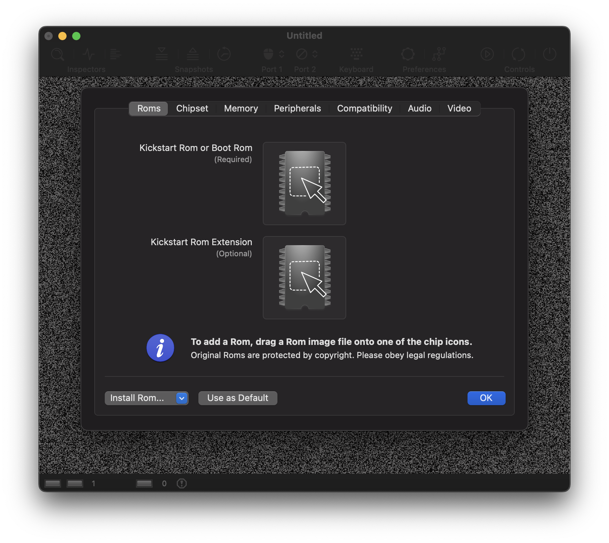
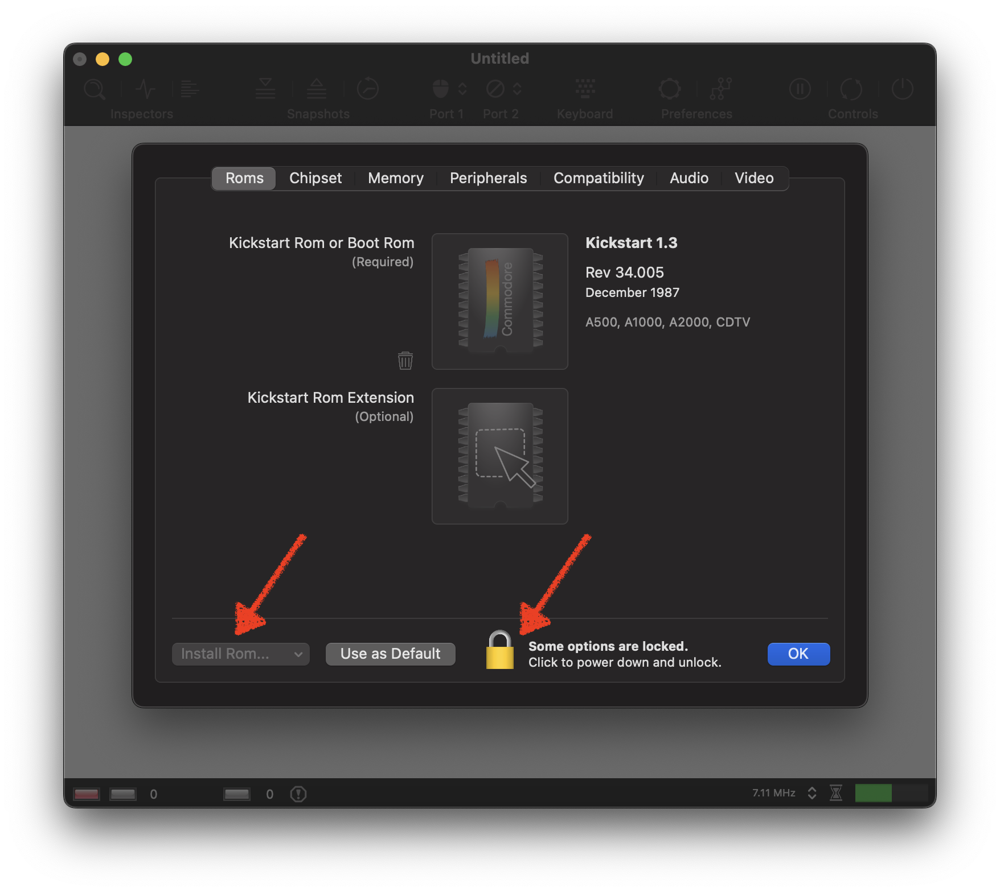
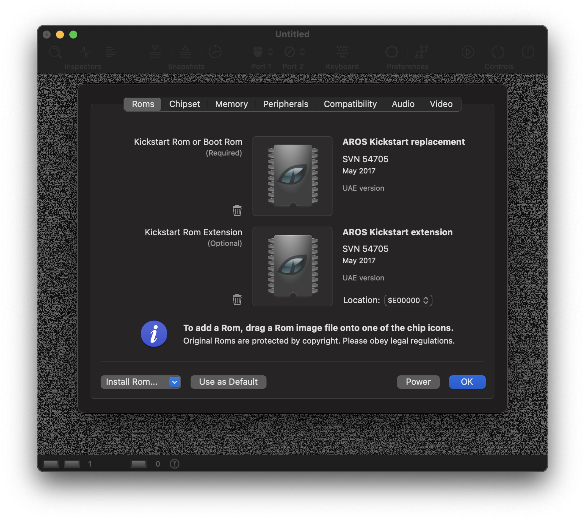
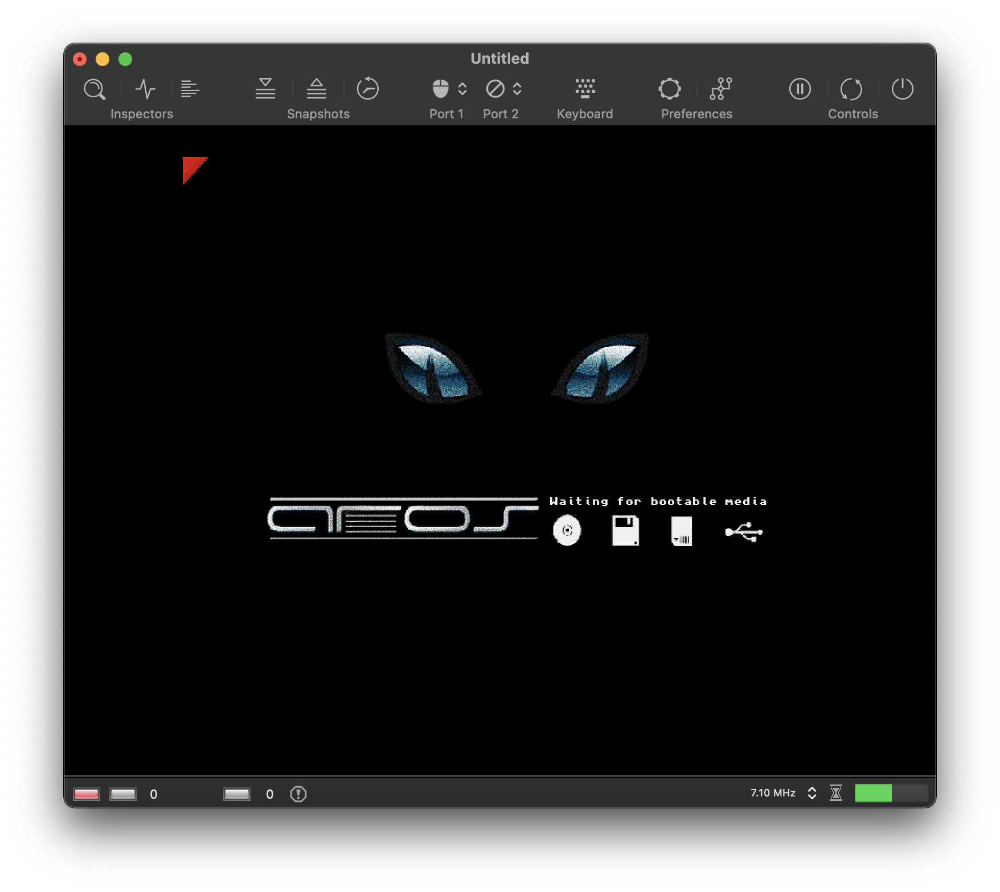
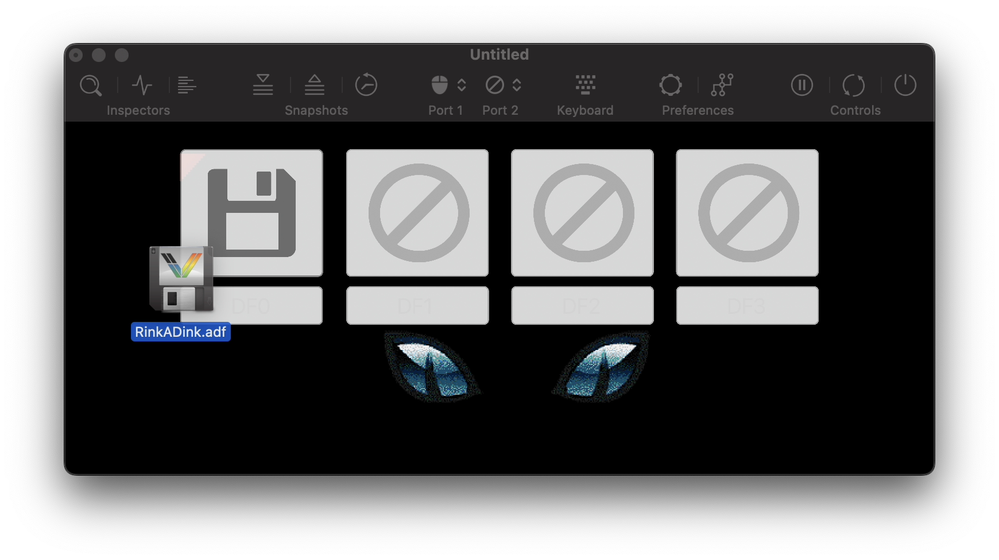
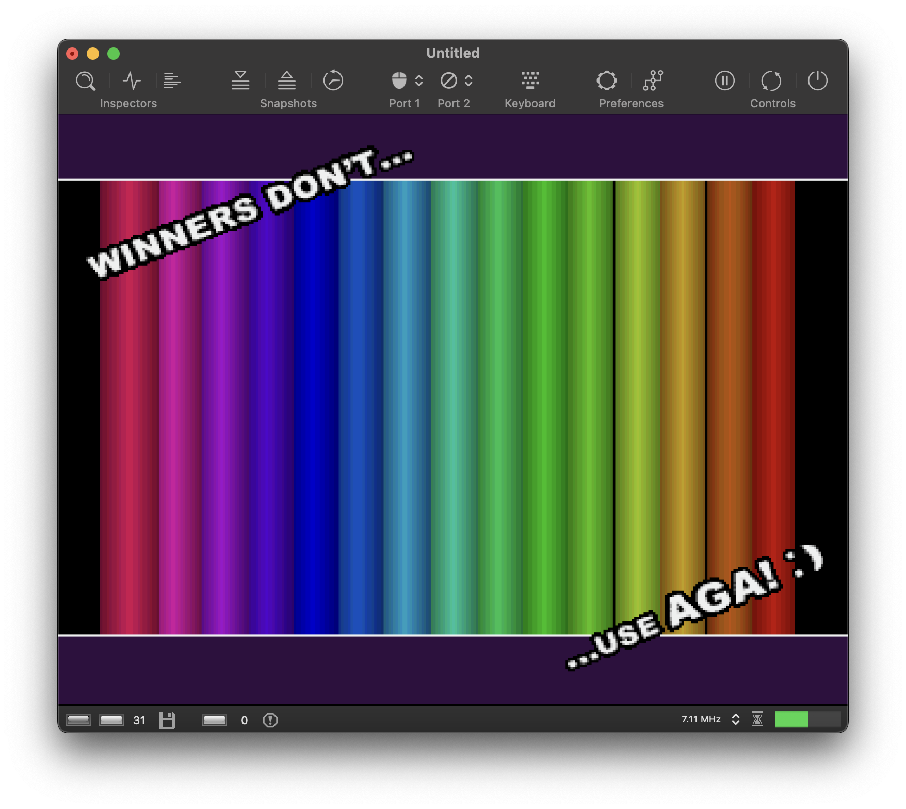

# Getting Started 

This tutorial describes how to launch vAmiga and install a Kickstart Rom.

## Installing vAmiga

Amiga is a native Mac application and as easy to install as most other Mac software. Download the latest version from the main page and copy the executable into the application folder. 

vAmiga's deployment target is macOS 10.15 (Catalina) which means that you can't run the app on earlier macOS releases. Please note that vAmiga is only extensively tested with the latest macOS version. Thus, compatibility problems may well occur with older macOS versions. 

Please keep in mind that vAmiga has been developed with limited work-power leaving no room for supporting older macOS releases. You can always extract older version from the source-code repository, but you will be on your own by doing so. 

## Installing a Kickstart Rom

Emulating an Amiga requires a Kickstart Rom. Since the original Amiga Roms are the intellectual property of Cloanto™, they cannot ship with the emulator. Thus, when opening vAmiga for the first time, the emulator will greet you with a Rom dialog:

In this dialog, a Kickstart Rom can be added via drag and drop. If you are the legal owner of a Rom image, you can easily install it by dragging it over the Rom icon:

Once the Rom is installed, the emulator is ready to be powered on. To do so, click the power button and have fun with your new old Amiga:

In case you don't own a legal Rom, you can alternatively start vAmiga with the free Aros Kickstart replacement. Aros Roms ship with the emulator and can be selected from the *Install Rom* popup-menu located in the lower left corner. 

At you can see below, the popup menu is presently grayed out therefore inaccessible. This is to protect against accidental changes to the Kickstart Rom while the emulator is running. To access the menu, turn off the emulator first by clicking on the lock icon. 

After the emulator has been powered off, the Aros Replacement Roms can be installed with a single click: 

Again, clicking the power button starts the emulator. With the free Kickstart Rom replacement installed, the Aros boot screen shows up:

Even though the Aros Roms are a great achievement of the open source community, we recommend installing original Commodore Roms as they offer much higher compatibility.

Please keep in mind that vAmiga will not remember the Rom settings by default, i.e., the next time the emulator is started, the Rom dialog will appear again. If you wish to use the currently installed Rom permanently, click the *Use as Default* button next to the Aros button.

## Inserting a floppy disk

Next, we'll show how to insert a floppy disk. Thanks to the diligent work of many Amiga enthusiasts, almost all Amiga software from back in the day has been saved from decay and translated into modern data formats. The most important data format for the Amiga is the ADF format, which is a digital image of an Amiga floppy disk. On the Internet you will find countless ADFs and most likely your beloved titles from back then, too. Please note that despite their age, most Amiga titles are protected by copyright and may not be used without the permission of the rights holders.

The most convenient way to insert a floppy disk is per drag and drop. When an ADF file is dragged into the emulator window, four drop zones appear representing drives Df0 through Df3. Simply drop the file onto the drive in which you want to insert the disk. 

Shortly after dropping the disk onto the drop zone for drive Df0, the Amiga recognizes the inserted disk and starts to boot. In the example above, we've inserted a bootable version of *Rink a Dink*, a popular Amiga demo which was published in 1993 by *Lemon*. The demo works flawlessly with the Aros Replacement Roms as it takes over the machine entirely.

